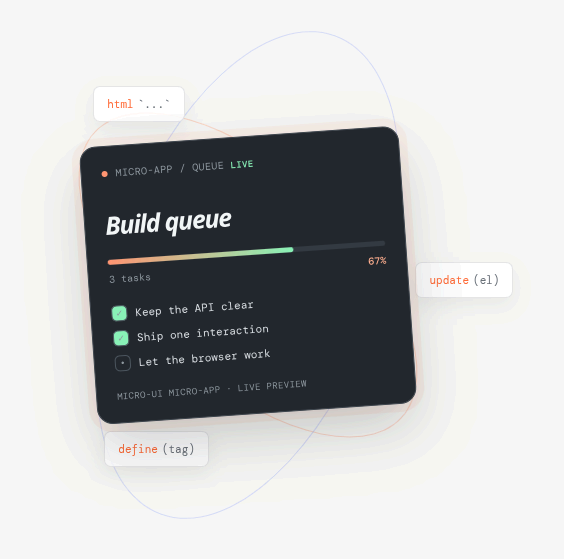

<div align="center">

# Micro-UI

*An [Open Tech Foundation](https://opentechf.org/) project*

A tiny runtime for AI-generated micro-apps



</div>

> *A tiny functional JavaScript UI library for AI agents to generate lightweight, interactive micro-apps.*

## Features

* **Lightweight** — zero dependencies, no build step, no virtual DOM overhead.
* **Simple state management** — use plain variables or the built-in `store` for shared state.
* **Smooth updates** — changes are batched and applied efficiently, no flicker or jank.
* **Form-friendly** — inputs, video, canvas, focus, and scroll position all survive re-renders.
* **Stable lists** — reorder, add, or remove items without losing element state.
* **Dynamic attributes** — bind classes, styles, and props with simple template expressions.
* **Secure by default** — user content is auto-escaped to prevent injection attacks.
* **Fault tolerant** — one broken component won't crash the rest of your app.
* **AI-ready** — minimal API surface that agents can generate without a toolchain.

## Installation

```sh
pnpm add @opentf/micro-ui
# or
npm i @opentf/micro-ui
# or
yarn add @opentf/micro-ui
# or
bun add @opentf/micro-ui
```

```js
import {
  define,
  html,
  store,
  update,
  flush,
  mount,
  onReady,
  onError,
} from "@opentf/micro-ui";
```

## Quick Start

```html
<script type="module">
import { define, html, update } from "https://esm.sh/@opentf/micro-ui/min";

define("x-counter", (el, props) => {
  let count = Number(props.count || 0);

  return () => html`
    <button onclick=${() => { count++; update(el); }}>
      Count: ${count}
    </button>
  `;
});
</script>

<x-counter count="0"></x-counter>
```

**CDN alternatives:**

```js
// esm.sh
import { define, html, update } from "https://esm.sh/@opentf/micro-ui/min";

// esm.run (via jsDelivr)
import { define, html, update } from "https://esm.run/@opentf/micro-ui/min";

// unpkg
import { define, html, update } from "https://esm.unpkg.com/@opentf/micro-ui/min";
```

## Usage

### Lifecycle

```js
define("x-demo", (el, props) => {
  let data = [];

  // Post-render setup & cleanup
  onReady(() => {
    const interval = setInterval(() => update(el), 1000);
    return () => clearInterval(interval); // cleanup on disconnect
  });

  // Error handling
  onError((target, err, phase) => {
    console.error(`Failed in ${phase}:`, err);
  });

  return () => html`<p>${data.length} items</p>`;
});
```

### State & updates

```js
define("x-counter", (el) => {
  let count = 0;

  return () => html`
    <button onclick=${() => { count++; update(el); }}>
      ${count}
    </button>
  `;
});
```

### Composition

```js
define("x-child", (el, props) => {
  return () => html`<span>${props.name}</span>`;
});

define("x-parent", (el) => {
  let name = "World";
  return () => html`<x-child name=${name}></x-child>`;
});
```

## API

### `define(tag, setup)`

Registers a custom element. `setup(el, props)` runs once on connect and must return a render function.

```js
define("x-greeting", (el, props) => {
  let name = props.name || "World";
  return () => html`<h2>Hello, ${name}</h2>`;
});
```

### `html`

Tagged template that produces a renderable tree. Supports text, attributes, events, keyed lists, conditionals, and nesting. Text is escaped by default.

```js
html`<button onclick=${handler} class="btn ${active}">Click</button>`
```

### `html.raw`

Trusted HTML opt-in — bypasses escaping. Never pass user input.

```js
html.raw`<div>${trustedMarkup}</div>`
```

### `update(el)`

Triggers a re-render. Multiple calls are batched into a single update. No-op on errored components.

### `flush()`

Immediately processes pending updates synchronously.

```js
update(el);
flush(); // DOM is now up to date
```

### `mount(el, tag)`

Clears a host element and appends a new Custom Element. Returns the child.

```js
const app = mount(document.getElementById("app"), "x-app");
```

### `onReady(cb)`

Runs after initial render. Return a function for cleanup on disconnect. Call inside `setup`.

```js
define("x-widget", (el) => {
  onReady(() => {
    return () => console.log("cleaned up");
  });
  return () => html`<p>Hello</p>`;
});
```

### `onError(handler)`

Registers a callback when `setup`, `render`, or `reconcile` throws. Call inside `setup`.

```js
define("x-widget", (el) => {
  onError((target, err, phase) => {
    console.error(`Error in ${phase}:`, err);
  });
  return () => html`<p>Hello</p>`;
});
```

### `store.get(key)` / `store.set(key, value)`

Simple key-value store. Get with `store.get`, set with `store.set`. Does not trigger DOM updates — connect to components via `store.subscribe`.

```js
store.set("counter", 0);
store.get("counter"); // 0
store.set("counter", 1);
```

### `store.set(key, value, { path })`

Set a nested value by dot-separated path. Immutably clones the object tree along the path.

```js
store.set("form", { name: "", email: "" });
store.set("form", "Ada", { path: "name" });
store.get("form", { path: "name" }); // "Ada"
```

### `store.subscribe(key, fn)`

Listen for changes to a store key. Returns an unsubscribe function. Call inside `onReady` to connect store changes to component re-renders.

```js
define("x-counter", (el) => {
  onReady(() => store.subscribe("counter", () => update(el)));
  return () => html`<span>${store.get("counter")}</span>`;
});
```

### `store.del(key)` / `store.del(key, { path })`

Delete a store key (resets to `undefined`) or remove a nested key from an object value. Notifies subscribers.

```js
store.del("counter");                   // full key deleted
store.del("form", { path: "name" });   // only removes "name", rest intact
```

## Security

### HTML escaping by default

All `${value}` text interpolations are escaped automatically. The five standard HTML-significant characters are converted to entities:

| Character | Entity |
|-----------|--------|
| `&` | `&amp;` |
| `<` | `&lt;` |
| `>` | `&gt;` |
| `"` | `&quot;` |
| `'` | `&#39;` |

This means user-supplied content is safe to render directly:

```js
const userInput = '<script>alert("xss")</script>';
html`<p>${userInput}</p>` // renders as literal text, not markup
```

### Trusted HTML opt-in (`html.raw`)

When you need to render trusted markup, use `html.raw`:

```js
html.raw`<b>${boldText}</b>` // parsed as real HTML
```

`html.raw` still stringifies interpolated values, but the entire result is treated as markup and parsed via `innerHTML`. **Never pass user-controlled input to `html.raw`.**

### Error isolation

A throwing `setup`, `render`, or `reconcile` is caught and isolated per-component:

- The failed element is replaced with a small inline error box (`<div data-micro-ui-error>`).
- The instance is marked `errored` — further `update()` calls are no-ops.
- The host page and all sibling components continue running normally.
- Recovery requires removing the element from the DOM and creating a fresh one.

```js
define("x-safe", (el) => {
  onError((target, err, phase) => {
    console.error(`Error in ${phase}:`, err);
  });

  return () => {
    if (Math.random() > 0.5) throw new Error("boom");
    return html`<p>Works</p>`;
  };
});
```

# Micro-UI Utils

A tiny, semantic, framework-free CSS utility and component layer for building **Micro-UI apps**.

**No Tailwind. No Bootstrap. No build step required.**

```js
import "@opentf/micro-ui/styles.css"; // full bundle (tokens + base + components)
```

Split imports — pay only for what you use:

```js
import "@opentf/micro-ui/styles/tokens.css";     // vars only
import "@opentf/micro-ui/styles/base.css";        // reset + layout
import "@opentf/micro-ui/styles/components.css"; // buttons, forms, cards...
```

Or via CDN:

```html
<link rel="stylesheet" href="https://unpkg.com/@opentf/micro-ui/dist/styles.min.css">
<!-- or split -->
<link rel="stylesheet" href="https://unpkg.com/@opentf/micro-ui/dist/styles/tokens.min.css">
```

## Class Reference

| Category | Classes |
|----------|---------|
| **Layout** | `ui-container`, `ui-stack`, `ui-row`, `ui-grid`, `ui-grid-2/3/4`, `ui-wrap`, `ui-center`, `ui-between`, `ui-grow` |
| **Spacing** | `ui-gap-{1,2,3,4,5,6,8,10,12}`, `ui-p-{0,2,3,4,5,6,8}`, `ui-px-{4,6}`, `ui-py-{2,4,6}`, `ui-mt-{2,4,6,8}`, `ui-mb-{2,4,6,8}` |
| **Typography** | `ui-title`, `ui-heading`, `ui-text`, `ui-muted`, `ui-label`, `ui-caption`, `ui-error-text`, `ui-link` |
| **Buttons** | `ui-btn`, `ui-btn-primary`, `ui-btn-secondary`, `ui-btn-ghost`, `ui-btn-danger`, `ui-btn-success`, `ui-btn-sm`, `ui-btn-lg`, `ui-btn-icon` |
| **Forms** | `ui-field`, `ui-input`, `ui-textarea`, `ui-select`, `ui-checkbox`, `ui-radio`, `ui-switch` |
| **Surfaces** | `ui-card`, `ui-card-flat`, `ui-card-hover`, `ui-panel`, `ui-section` |
| **Badges** | `ui-badge`, `ui-badge-primary/success/warning/danger/info` |
| **Alerts** | `ui-alert`, `ui-alert-info/success/warning/danger` |
| **Progress** | `ui-progress`, `ui-progress-bar`, `ui-progress-success/danger` |
| **Loading** | `ui-spinner`, `ui-spinner-sm/lg` |
| **Avatar** | `ui-avatar`, `ui-avatar-sm/lg` |
| **Lists** | `ui-list`, `ui-list-item`, `ui-list-item-hover` |
| **Tables** | `ui-table-wrap`, `ui-table`, `ui-table-hover` |
| **Navigation** | `ui-tabs`, `ui-tab`, `ui-breadcrumbs`, `ui-pagination` |
| **Menus** | `ui-menu`, `ui-menu-item`, `ui-menu-divider` |
| **Dialogs** | `ui-modal`, `ui-dialog`, `ui-dialog-header/body/footer` |
| **Drawer** | `ui-drawer`, `ui-drawer-left/right`, `ui-drawer-header/body` |
| **Tooltip** | `ui-tooltip`, `ui-tooltip-content` |
| **Empty State** | `ui-empty`, `ui-empty-icon` |
| **Skeleton** | `ui-skeleton` |
| **Status** | `ui-status`, `ui-status-success/warning/danger/info` |
| **Drag & Drop** | `ui-draggable`, `ui-dropzone`, `ui-dragging` |
| **Utilities** | `ui-hidden`, `ui-visible`, `ui-w-full`, `ui-rounded-*`, `ui-shadow-*`, `ui-relative/absolute/fixed/sticky` |
| **States** | `is-active`, `is-disabled`, `is-loading`, `is-invalid`, `is-dragover`, `is-dragging` |

## Theming

Override CSS custom properties for theming:

```css
:root {
  --ui-primary: #2563eb;
  --ui-primary-hover: #1d4ed8;
}
```

Dark mode — automatic via `@media (prefers-color-scheme: dark)` in tokens. Override it on any element with `data-theme="dark"` or `data-theme="light"`; an explicit attribute always wins over the system preference (and you can theme individual containers).

Layers — all rules are in `@layer micro-ui.*` so your app CSS wins without `!important`:
```css
@layer micro-ui, app; /* app layer after micro-ui */
```

Opt-in CSS — `package.json` has `"sideEffects": ["*.css"]` so JS tree-shakes, import CSS only where needed.

> **[Full CSS Documentation](./packages/micro-ui/docs/css-utils.md)**

---

## Design

- **State**: ordinary JavaScript closures. Optional built-in `store`/`subscribe`/`del` for shared state — still no signals or reactive primitives.
- **Composition**: native Custom Elements. `<x-parent>` contains `<x-child>` as regular HTML.
- **DOM identity**: elements, inputs, videos, canvases survive updates. No `innerHTML` rebuilds.
- **Reconciliation**: positional by default; keyed when `key` present (`key=${id}`) — stable DOM reuse for cart / data lists. Matches old and new children by index or key. Unchanged nodes are reused. Changed nodes are patched in place.

## What This Is Not

- Not a React/Vue/Angular replacement for large apps
- Not optimized (v0 uses a full internal tree for correctness)
- Not a build tool or compiler
- No SSR/hydration — client islands only; updates are batched via `queueMicrotask`

## License

MIT
